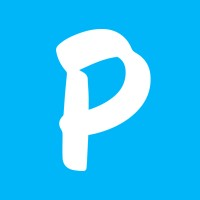
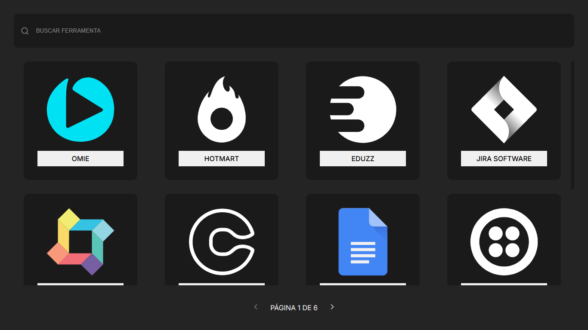
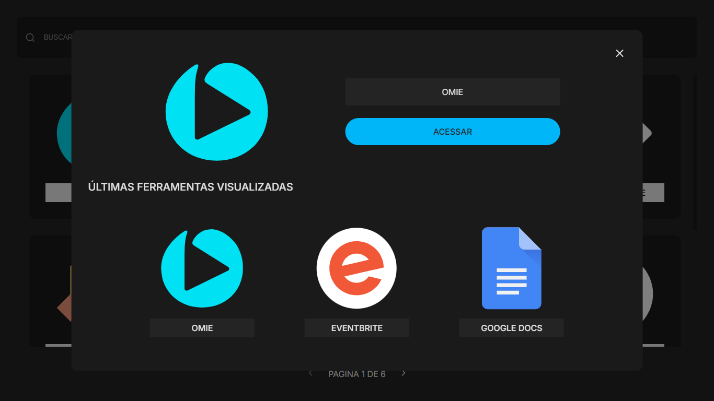

<h1 align="center" style="text-align: center;">
  
  Desafio da Pluga - Dev jr
</h1>

> Apps integrados na Pluga

<p align="center">
  <a href="#project">Projeto</a>&nbsp;&nbsp;&nbsp;|&nbsp;&nbsp;&nbsp;
  <a href="#technologies">Tecnologias</a>&nbsp;&nbsp;&nbsp;|&nbsp;&nbsp;&nbsp;
  <a href="#usage">Utilização</a>&nbsp;&nbsp;&nbsp;|&nbsp;&nbsp;&nbsp;
</p>

<h2 id="project">📁 Projeto</h2>

O projeto consiste numa tela com uma listagem de cards representando os apps integrados na Pluga e uma barra de busca.

A aplicação usa os dados retornados em [pluga.co/ferramentas_search.json](https://pluga.co/ferramentas_search.json) para construir essa listagem, com uma paginação de 12 em 12 apps.



Ao clicar nos cards, é aberto um modal referente ao app selecionado com um link para acessar a página do app no site da Pluga.

Esse modal contém uma seção "Últimas ferramentas visualizadas", que mostra as 3 últimas ferramentas visualizadas, independente de quantos cards de apps sejam acessados.



<h2 id="technologies">💻 Tecnologias</h2>

Este projeto foi desenvolvido com as seguintes tecnologias:

- ReactJS
- ReactDOM
- React Icons
- Styled Components
- ViteJS

<h2 id="usage">💡 Utilização</h2>

A aplicação está disponível para uso [aqui](https://pluga-dev-challenge.netlify.app/).

Você também pode executá-la em sua máquina localmente. Certifique-se de ter o `Node.js` e o `npm` instalados antes de prosseguir com as etapas abaixo:

1. Clone o projeto:

```
$ git clone https://github.com/madalena-rocha/pluga-challenge
```

2. Acesse a pasta do projeto:

```
$ cd pluga-challenge
```

3. Instale as dependências:

```
$ npm install
```

4. Inicie o servidor:

```
$ npm run dev
```

---

Feito com 💙 by Madalena 👋🏾

<div style="display: flex;">
  <a href="https://www.linkedin.com/in/madalena-machado-rocha/" target="_blank"></a>
  <a href="mailto:rochamada1997m@gmail.com"></a>
